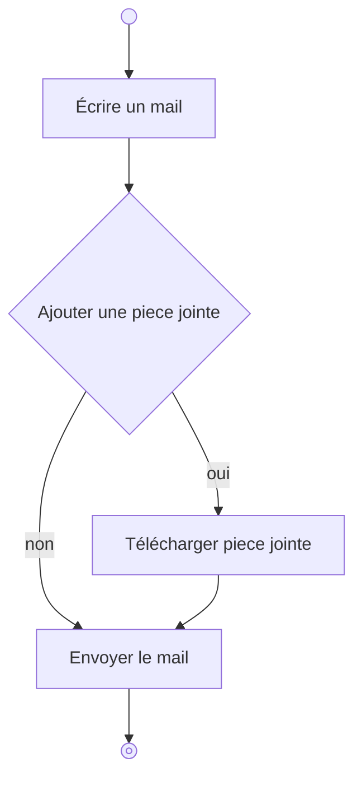
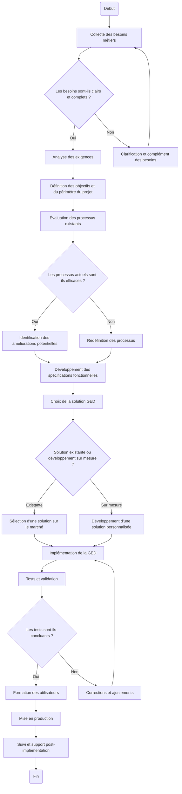

# Cours de cahier des charges

## exo 1

Diagramme de flux d'utilisateur pour envoyer un mail avec piece jointe

## exo 2

A partir du premier TP pour pour le Gestionnaire Électronique de Documents.
Créer le diagramme de flux d'utilisateur pour ajouter un document.

